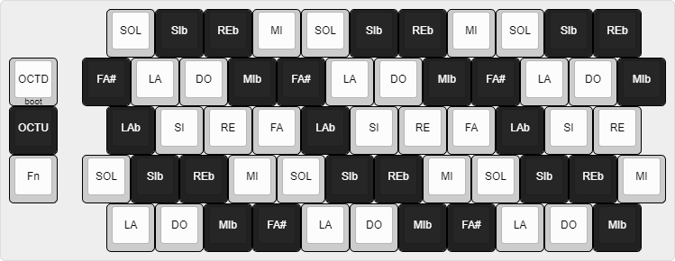
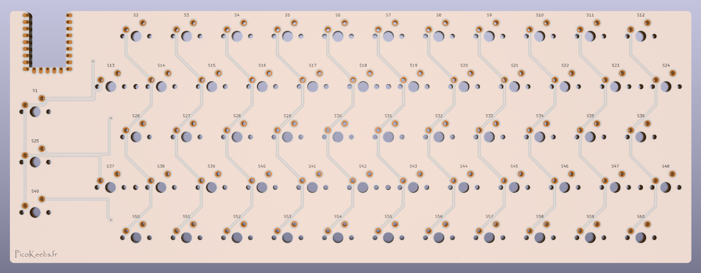
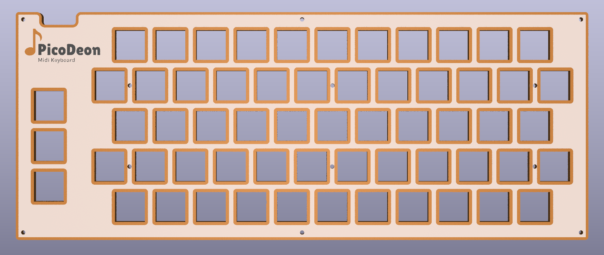
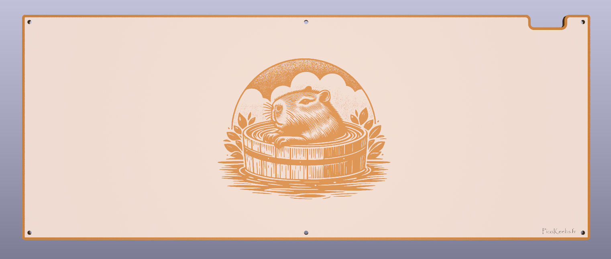

# PicoDeon, a midi chromatic accordion keybaord - DIY Project

Unable to find a MIDI accordion keyboard online! Isn't that strange? Everyone could use one, though... Well, no worries! I'm going to make my own :)

Buy one on [PicoKeebs.fr](https://www.picokeebs.fr/picodeon.php)
You can watch a short demonstration on youtube [here](https://youtu.be/MS7t3GJ2ovU) 

Shield: [![CC BY-NC-SA 4.0][cc-by-nc-sa-shield]][cc-by-nc-sa]

This work is licensed under a [Creative Commons Attribution-NonCommercial-ShareAlike 4.0 International License][cc-by-nc-sa].

[![CC BY-NC-SA 4.0][cc-by-nc-sa-image]][cc-by-nc-sa]

[cc-by-nc-sa]: http://creativecommons.org/licenses/by-nc-sa/4.0/
[cc-by-nc-sa-image]: https://licensebuttons.net/l/by-nc-sa/4.0/88x31.png
[cc-by-nc-sa-shield]: https://img.shields.io/badge/License-CC%20BY--NC--SA%204.0-lightgrey.svg
